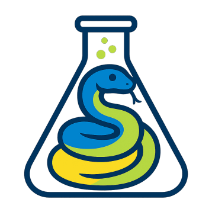
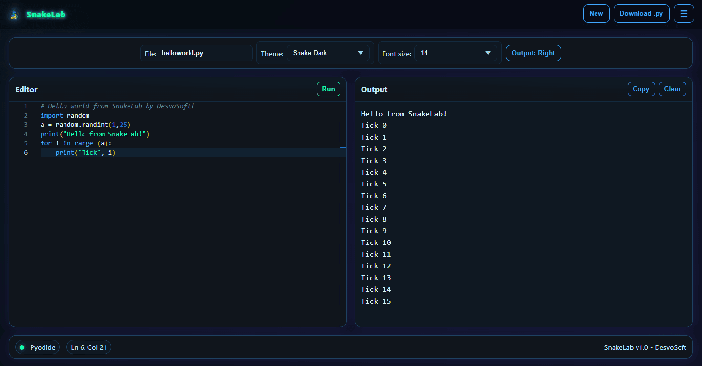

# 🐍 SnakeLab

**SnakeLab** is a lightweight, futuristic-themed **Python playground** that runs entirely in your browser — no server, no installs, no sign-up.  
Powered by [Pyodide](https://pyodide.org/) for Python execution and [Monaco Editor](https://microsoft.github.io/monaco-editor/) for a rich editing experience.

---

## Features

- **Runs in the browser** — zero backend, works offline after first load.
- **Single-file workflow** — no complex file system, just one focused coding buffer.
- **Auto-save** — your code stays in local storage until you clear it.
- **Download to `.py`** — export your current code anytime.
- **Customizable editor** — change theme, font size, and output panel layout.
- **Easy output management** — copy or clear console output with one click.
- **Keyboard shortcuts**:
  - **Run**: `Ctrl` + `Enter` / `Cmd` + `Enter`
  - **Rename file**: edit filename field
  - **New file**: click `New` (with confirmation)

---

## 🛠 Built With

* [Pyodide](https://pyodide.org/) — Python compiled to WebAssembly.
* [Monaco Editor](https://microsoft.github.io/monaco-editor/) — the same editor used in VS Code.
* Vanilla JS, HTML, CSS — no build tools or frameworks required.

---

## UI Overview

* **Editor Panel**: Write Python code with syntax highlighting.
* **Output Panel**: See printed output, errors, and exceptions.
* **Toolbar**:

  * `New` — clear buffer (asks for confirmation).
  * `Download .py` — save current code to your device.
  * Theme & font size selectors — customize the editor look.
  * Layout toggle — switch output between right side or bottom.
